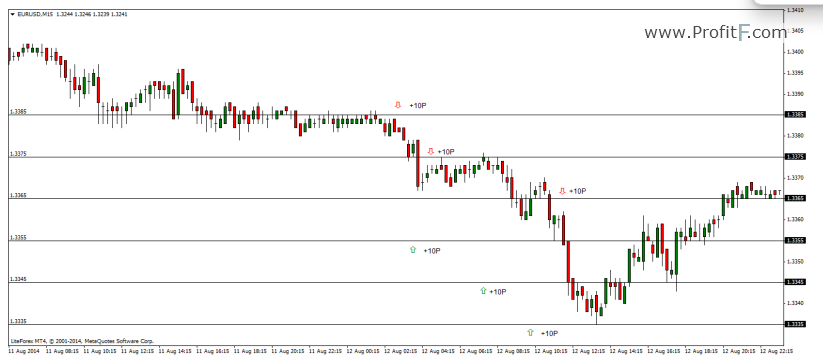

# Grid Strategy for Stock Market

The Grid trading is a type of trading strategy that profits from the sideways as well as trending market conditions. In the simplest of terms, Grid trading involves hedging, or placing simultaneous buy and sell orders at certain levels. The aim of this approach is to maximize the profits while the in-built hedging system ensures that the risks are minimized.

Grid trading typically requires a grid. The grid or levels can be based on a trader’s preference. For example, a 10 Pip grid with 5 levels could be used on EURUSD with Buy and Sell orders. The chart below shows one such example.

[source: Profitf.com](https://www.profitf.com/articles/forex-education/grid-trading/)

## NYSE version

I pick a stock for long horizon investment to carry on this strategy.
